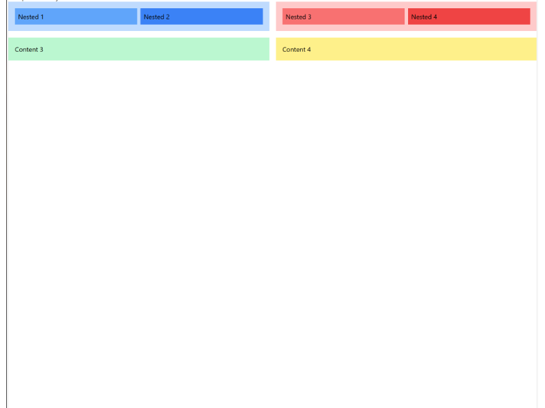

# ALX Intermediate Frontend

## 0x00-semantic_html

This project focuses on building a solid foundation in semantic HTML, emphasizing accessibility, SEO optimization, and the implementation of ARIA roles for enhanced usability through incremental tasks.

---

### Learning Objectives

- **Master Semantic HTML:**  
  Structure web pages using semantic elements such as `<header>`, `<main>`, `<article>`, `<section>`, and `<footer>` for better content organization and accessibility.

- **Optimize for SEO:**  
  Improve the visibility of your webpage through appropriate usage of meta tags and proper document structure.

- **Enhance Accessibility:**  
  Implement ARIA roles and attributes to make web forms and content more accessible to users with disabilities.

- **Understand Form Design Best Practices:**  
  Create accessible and user-friendly forms using modern HTML techniques.

- **Adopt Incremental Development:**  
  Practice progressive enhancement by building upon the foundation of each previous task.

---

## Tasks

### Task 0: Basic Semantic Structure

**Objective:**  
Practice structuring a simple HTML document using semantic elements.

**Instructions:**

1. Create `0-index.html`.
2. Inside the `<html>` tag, create empty `<head>` and `<body>` tags (in that order).
3. In the `<body>` tag:
   - Add a `<header>` containing a `<nav>` with at least three links.
   - Create a `<main>` section containing an `<article>`. Inside the `<article>`, add:
     - An `<h1>` tag for the title.
     - A `<section>` for the content.
   - Add a `<footer>` with copyright information.

> **Note:** Remember to include the `<!DOCTYPE html>` declaration.

---

### Task 1: SEO & Accessibility Meta Tags

**Objective:**  
Enhance the structure of the HTML document by adding meta tags for improved SEO, accessibility, and responsiveness.

**Instructions:**

1. Copy the content of `0-index.html` into `1-index.html`.
2. Inside the `<head>` tag, add:
   - `<meta charset="utf-8">`
   - `<meta name="description" content="A blog post about semantic HTML and accessibility practices">`
   - `<meta name="keywords" content="HTML, Semantic, Accessibility, Blog, SEO">`
   - `<meta name="author" content="[Your Name]">`
   - `<meta name="viewport" content="width=device-width, initial-scale=1.0">`
   - `<title>Semantic HTML Blog Post</title>`

---

### Task 2: Blog Post Layout with Semantic Elements

**Objective:**  
Apply semantic elements to create a blog post layout.

**Instructions:**

1. Copy the content of `1-index.html` into `2-index.html`.
2. Inside the `<header>` tag:
   - Add an `<h1>` with the content "My Blog".
   - Add a `<nav>` containing a `<ul>` with three `<li>` items: Home, About, Contact.
3. Inside the `<article>` tag (within `<main>`):
   - Add a `<header>` with an `<h2>`: "Understanding Semantic HTML".
   - Add a `
`:  
     `Published on <time datetime="2024-09-10">September 10</time>.`
   - Inside the `<section>`:
     - Add an `<h3>`: "Introduction".
     - Add a `
`:  
       "Semantic HTML helps improve the accessibility and SEO of your website. In this post, we'll explore its benefits and how to implement it."
   - Below the previous section, add another `<section>`:
     - Add an `<h3>`: "Main Content".
     - Add a `
`:  
       "Using elements like `<article>`, `<section>`, and `<header>` ensures that both users and search engines can better understand the structure and content of a webpage."
     - Add a `<figure>` containing:
       - An ``
       - A `<figcaption>`:  
         "By adopting semantic HTML, you enhance your site's accessibility, improve SEO, and make the content easier to navigate."
   - Add a `<footer>` inside the `<article>`:
     - `
`: "Written by [Your Name]"
     - `
`: "Published on 2024-09-11"

> **Note:** All changes are within the `<article>` tag inside `<main>`. Remember to close all tags.

---

### Task 3: Accessible Form with ARIA Roles

**Objective:**  
Implement ARIA roles to improve accessibility in a form.

**Instructions:**

1. Copy the content of `2-index.html` into `3-index.html`.
2. Inside the `<main>` element, add a new `<section>`.
3. In the new section, add a `<form>` with the following attributes:
   - `action="#"`, `method="POST"`, `aria-labelledby="form-title"`, `role="form"`
4. Inside the form:
   - Add a `
` containing:
     - `<label for="name">Name</label>`
     - `<input type="text" id="name" name="name" aria-required="true">`
   - Add another `
` containing:
     - `<label for="email">Email</label>`
     - `<input type="text" id="email" name="email" aria-required="true">`
   - Add another `
` containing:
     - `<button type="submit" aria-label="Submit the Form">Submit</button>`
   - Add another `

`

> **Note:** Remember to close all tags.

---

## 0x02-tailwind-css

### Project Description

This project is a hands-on exploration of Tailwind CSS, focusing on building responsive and aesthetically pleasing web layouts. Each task introduces advanced Tailwind concepts, enabling learners to effectively utilize utility-first CSS for modern web development.

You will create layouts ranging from basic CSS grids and flexbox navigation bars to complex multi-section layouts that combine both CSS Grid and Flexbox. This progressive approach ensures a deep understanding of responsive design principles while mastering Tailwind CSS.

---

### Learning OBjectives
- Master Tailwind CSS Configuration: Learn how to install and configure Tailwind CSS, enabling seamless integration into projects.
- Build Responsive Layouts: Implement complex, responsive layouts using Tailwind’s utility classes and responsive modifiers.
- Combine CSS Grid and Flexbox: Develop advanced page structures by leveraging both grid and flexbox techniques.
- Design Aesthetically Pleasing Components: Use Tailwind’s extensive styling utilities to create visually appealing designs with gradients, spacing, and colors.
- Optimize for Professional Development: Enhance professional web development skills by adhering to best practices in structuring, coding, and managing CSS frameworks.

### Requirements
- Node.js installed on the local machine. Click here
- Basic knowledge of HTML, CSS, and JavaScript.
- Familiarity with a code editor (VSCode) and browser developer tools.
- GitHub account for repository management.
- Tailwind CSS installed via npm or CDN.
- Modern browser to render and test the designs.
- Internet connection for accessing Tailwind’s documentation and CDN links.

### Task 0: Setting Up and Installing Tailwind cSS with configuration
__Objective__: Set up and install tailwind

- Install tailwind css
- in your current qworking directory, create  file named tailwind.config.js
- Add the following conde into it:
	- /** @type {import('tailwindcss').Config} */
module.exports = {
  content: ["./src/**/*.{html,js}"],
  theme: {
    extend: {},
  },
  plugins: [],
}
- Create a directory "src" inside of your current working directory
- Create a file named input.css inside the src directory. Inside the file, add the following code:
	- tailwind base;
	- tailwind components;
	- tailwind utilities;
- Run the tailwind CLI tool to scan your template files for classes and build your CSS output.css with:
	- npx tailwindcss -i ./src/input.css -o ./src/output.css --watch

__NB__: To see Tailwind CSS take effect you need to leave this CLI open and running all through out your testing of the project.

### Task 1: Createing a Responsove CSS Grid Layout with Tailwind CSS
__Objective__: Leverage on  tailwind to create a CSS grid layout

- Create a file named 1-index.html in the 0x02-tailwindcss folder
- copy the following code into it:
	- <!DOCTYPE html>
<html lang="en" dir="ltr">
<head>
    <meta charset="UTF-8">
    <meta name="viewport" content="width=device-width, initial-scale=1.0">
    <title>Basic CSS Grid Layout</title>
</head>
<body >
    <header>
        <h1>Basic CSS Grid Layout</h1>
    </header>

    <main>
        
Column 1

        
Column 2

        
Column 3

    </main>
   </body>
</html>

- Let's link our tailwind: Add the following code to the "head" tag in your 1-index.html file.
	- <link href="./output.css" rel="stylesheet
- Modify the "main" tag by creating a 3-column layout using css grid with a gap of 4. You can achieve this as follows:
	- class = "grid grid-cols-3 gap-4"
- Inside the main file, modify each div to have a background color of blue, with a shade level of 200 incremented by 100 across each div. Each should have a padding of 4 You can achieve this as follows:
	- class = "bg-blue-200 p-4"
	- class = "bg-blue-300 p-4"
	- class - "bg-blue-300 p-4"
- In the input.css file in your current directory, ensure the layout is responsive by adjusting the grid on smaller screens. You can achieve this by adding this code to it:
	-  @media (max-width: 768px) 
{ 
main { grid-template-columns: 1fr; } 
}

- Run your 1-index,html using the command
	- On Mac: open 1-index.html on your terminal
	- On Windows: start 1-index.html on your terminal
- Your output should be as follows:

### Task 3:
__Objective__: implement a more complex layout using nested grids for multiple sections of a page of the page

- Create a new file 2-index.Html and add the following content to it:
 - <!DOCTYPE html>
<html lang="en">
<head>
    <meta charset="UTF-8">
    <meta name="viewport" content="width=device-width, initial-scale=1.0">
    <title>Complex Grid Layout</title>
<link href="./output.css" rel="stylesheet">
</head>
<body>
    <header>
        <h1>Complex Grid Layout with Nested Grids</h1>
    </header>

    <main>
        

            
Nested 1

            
Nested 2

        

        

            
Nested 3

            
Nested 4

        

        
Content 3

        
Content 4

    </main>
    </body>
</html>

- Let’s start by adding basic styling to the page: give the body a padding of 4.
- Using tailwind’s grid utilities create a 2 x 2 grid layout with nested grids inside each grid cell. You can achieve this by:
	- inside the main tag, create 2 grid columns each with a gap of 4. i.e
		- `class="grid grid-cols-2 gap-4"`
- in the first div, create another grid with 2 cols, background color of blue, paddinng 4 and a gap of 2
	- `class="grid grid-cols-2 p-4 gap-2 bg-blue-200"`
- in the Nested 1 and Nested 2 divs, add a blue background color with a gradient of 400 and 500 respectively and a padding of 2:
	- `class="bg-blue-400 p-2"`
	`class="bg-blue-500 p-2"`
- Do the same to the second div only this time change background colour to red
	- `class="grid grid-cols-2 p-4 gap-2 bg-red-200"`
- Open your 2-index.html in the browser. Your output should be as follows:

### Task 3: Flexbox Basics - Build a Simple Navigation Bar
__Objective__: Use Tailwind and Flexbox to create a horizontal navigation bar that adjusts to different screen sizes.

- Create a file named 3-nav_index.html and inside it, add the following code:
	- <!DOCTYPE html>
<html lang="en">
<head>
    <meta charset="UTF-8">
    <meta name="viewport" content="width=device-width, initial-scale=1.0">
    <title>Flexbox Navigation Bar</title>
<link href="./output.css" rel="stylesheet">

</head>
<body class="p-4">
    <header class="mb-4">
        <h1 class="text-3xl font-bold">Flexbox Navigation Bar</h1>
    </header>

</body>
</html>
- Inside the body tag, after the header create a nav tag, with 4 a tags referring to Home, About, Services and contacts . This should be as follows:
	- <nav> 
<a href="#">Home</a> 
<a href="#">About</a> 
<a href="#">Services</a> 
<a href="#">Contact</a> 
</nav>
- Inside the nav add the following:
	- class="flex space-x-5 justify-center bg-gray-300 text-white p-4"
- In each a apply the following inline utility classes
	- class="px-2 text-xl hover:bg-gray-500 p-2 rounded-lg"
- Open your 3-nav_index.html in the browser. It should look like this:
	- 
